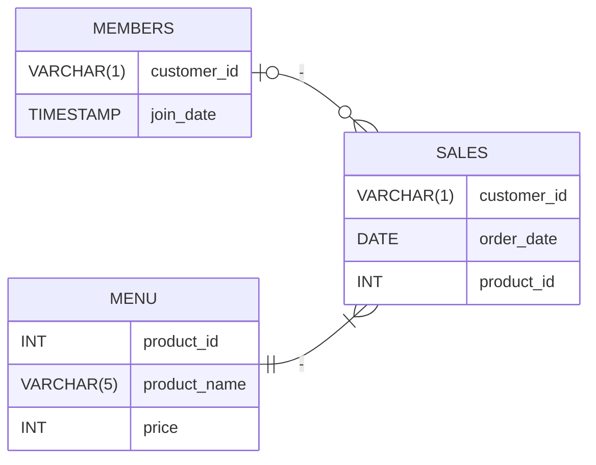

# **Case Study #1 - Danny's Diner**

## Creación de las tablas

* Las tablas para este resto son:
1. Menú (*Menu*) Guarda el id del producto, su nombre y su precio
2. Miembros(*Members*) Guarda el id del cliente y la fecha en que se registro.
3. Ventas(*Sales*) Guarda el cliente que ha realizado la compra, la fecha de compra, el id del producto comprado. Ademas de relacionar las tablas[^1]

## Diagrama 
[Diagrama de Danny](https://dbdiagram.io/d/Dannys-Diner-608d07e4b29a09603d12edbd)



```sql
CREATE TABLE IF NOT EXISTS menu (
    product_id INT PRIMARY KEY,
    product_name VARCHAR(5),
    price INT
);

CREATE TABLE IF NOT EXISTS members (
    customer_id VARCHAR(1) PRIMARY KEY,
    join_date TIMESTAMP
);

create TABLE IF NOT EXISTS sales (
    `customer_id` VARCHAR(1),
    `order_date` DATE,
    `product_id` INT,
    CONSTRAINT `product_id_fk` FOREIGN KEY (`product_id`) REFERENCES menu (`product_id`) ON UPDATE NO ACTION ON DELETE NO ACTION
);
```


```sql
INSERT INTO menu VALUES
(1, 'sushi', 10),
(2,	'curry', 15),
(3, 'ramen',	12);

INSERT INTO members VALUES
('A', '2021-01-07'),
('B', '2021-01-09');

INSERT INTO sales VALUES
('A', '2021-01-01', 1),
('A', '2021-01-01', 2),
('A', '2021-01-07', 2),
('A', '2021-01-10', 3),
('A', '2021-01-11', 3),
('A', '2021-01-11', 3),
('B', '2021-01-01', 2),
('B', '2021-01-02', 2),
('B', '2021-01-04', 1),
('B', '2021-01-11', 1),
('B', '2021-01-16', 3),
('B', '2021-02-01', 3),
('C', '2021-01-01', 3),
('C', '2021-01-01', 3),
('C', '2021-01-07', 3);
```

[^1]: Solo se ha hecho la relación de los productos, pues en el caso de los consumidores pueden no estar registrados como miembros. 
